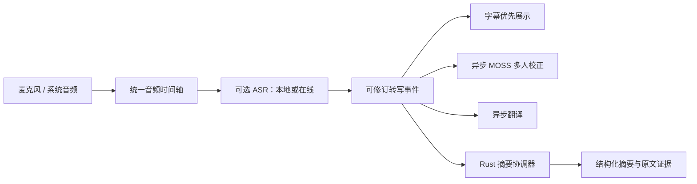

# Meeting

Meeting 是一个面向会议场景的实时会议助手，围绕双轨录音、实时转写、多人发言校正、双语字幕和会议总结组织会议内容。

<p align="center">
  
</p>

## 功能

- **双轨录音与时间对齐**：可分别选择麦克风、系统音频；两路音频映射到同一 48 kHz 时间轴，按 50 ms 音频块对齐，保留各自音源信息。
- **实时语音转写**：支持本地 Whisper、Parakeet，以及 Deepgram、OpenAI Realtime 在线流式识别；partial/final 结果以可修订事件更新。
- **多人发言校正**：MOSS 在独立异步链路中结合音频与稳定转写，补充说话人标签并校正内容。模型处理不会阻塞录音或首屏字幕。
- **会中摘要与会后整理**：Rust 摘要协调器根据稳定转写推进摘要状态，支持提示词模板、结构化要点和原文证据关联；保存会议后可继续生成或核对纪要。
- **双语字幕**：原文字幕先显示，翻译任务在旁路异步调度，译文按原转写事件关联后补齐。
- **悬浮字幕与会议助手**：可在会议画面上查看字幕和摘要要点，方便同时阅读文档、视频或设计稿。

<p align="center">
  
</p>

## 数据流



录音始终独立于 ASR、翻译和总结服务运行。模型或网络服务不可用时，相关 AI 结果可能延迟或缺失，不会因此停止音频采集。

## Windows 运行

便携脚本会把运行数据、模型、缓存和日志保存在项目的 `portable/\` 目录。准备好便携运行时后，运行：

```text
run-meetily.cmd
```

脚本会检查项目所在磁盘，拒绝将便携运行布局放在 `C:\` 盘。

## 源码开发

需要 Rust、Node.js 和 pnpm。前端依赖遵循 `frontend/pnpm-lock.yaml`。

```text
cd frontend
pnpm install --frozen-lockfile
pnpm exec tauri dev
```

如果使用仓库提供的便携工具链，可运行：

```text
scripts\run-meetily-dev-portable.cmd
```

## 验证

自动化测试使用合成音频和隔离数据，不依赖真实会议内容。常用检查包括：

```text
cd frontend
pnpm exec tsc --noEmit --incremental false
cd src-tauri
cargo test --locked -p meetily caption_overlay::tests --lib
```

MOSS 工程基线：RTX 4060 Laptop 8GB 上，热启动处理 17.803 秒合成双人音频耗时 5.585 秒（RTF 0.314）。这是一次合成音频推理吞吐测试，不代表真实会议的识别准确率或实时字幕延迟。

## 使用边界

- 当前 MOSS 接入方式是异步多人转写校正；首批实时字幕由所选本地或在线 ASR 提供。
- 说话人标签表示语音分段归属，不代表真实参会人身份识别。
- 翻译在转写事件产生后异步返回，不承诺逐字同步的同声传译效果。
- 会议摘要的质量、刷新速度取决于转写质量、模型响应和用户配置；仓库尚无真实会议端到端延迟基线。
- 启用在线识别、翻译或总结服务时，相应音频或文本会发送到所选服务；使用前请确认服务商的数据处理、隐私和费用政策。

## 项目结构

```text
frontend/       Tauri 桌面端、Next.js 界面与 Rust 服务逻辑
docs/           产品、架构和评测文档
scripts/        运行、构建和评测脚本
llama-helper/   模型辅助进程
```

## License

[MIT](LICENSE.md)
