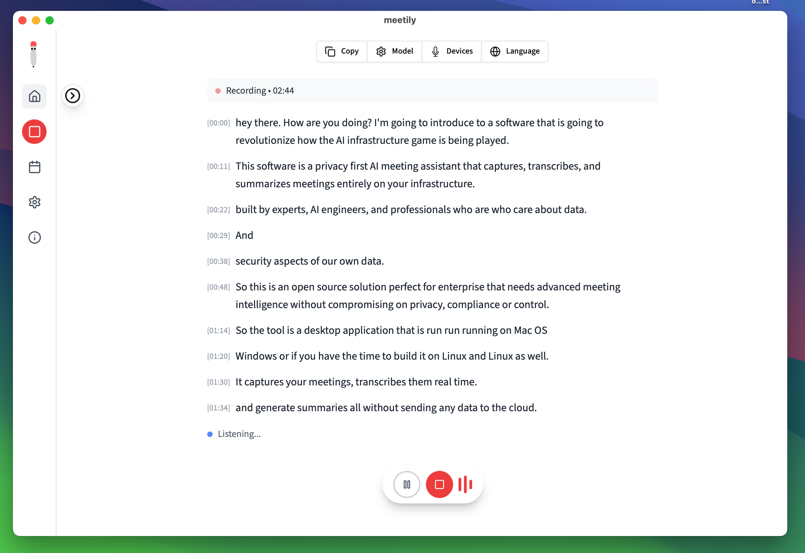
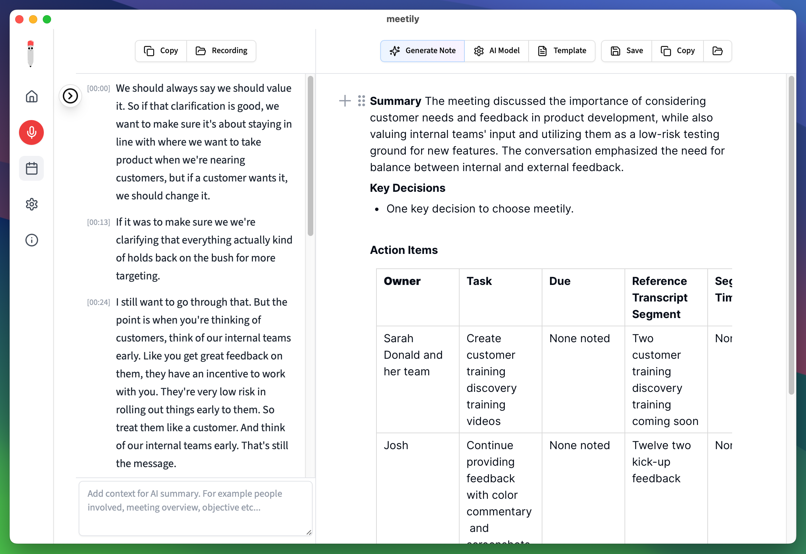
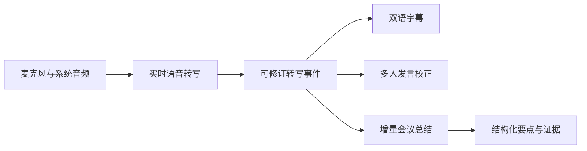

# Meeting

实时会议助手：把会议录音、实时转写、双语字幕、多人发言校正和结构化总结放在一条工作流中。

<p align="center">
  
</p>

## 它解决什么问题

会议中，人们需要在记录、理解外语和参与讨论之间来回切换。Meeting 持续处理会议音频，先展示可用的实时文字，再补充翻译、说话人校正和会议要点，让参会者可以专注于讨论。

## 主要能力

- **双音频录制**：独立选择麦克风和系统音频，模型或网络异常时不影响录音。
- **实时语音转写**：支持临时结果与最终结果，断线后可重连并重放缓冲内容。
- **多人发言校正**：使用 MOSS 对完整音频窗口进行异步校正，输出说话人标签。
- **双语悬浮字幕**：支持中英、日中字幕，窗口可拖拽、置顶，并调节尺寸、字号、透明度和鼠标穿透。
- **结构化会议总结**：增量整理主题、决策、行动项和风险，支持自定义提示词，并保留转写证据。

<p align="center">
  
</p>

## 数据流



## Windows 运行

仓库中的便携脚本会把运行数据、模型、缓存和日志放在项目的 `portable/` 目录中。准备好便携运行时后，双击：

```text
run-meetily.cmd
```

脚本会检查项目所在磁盘，并拒绝把便携运行布局放在系统盘根目录下。

## 源码开发

需要 Rust、Node.js 和 pnpm。前端依赖遵循 `frontend/pnpm-lock.yaml`。

```text
cd frontend
pnpm install --frozen-lockfile
pnpm exec tauri dev
```

如果使用仓库提供的便携工具链，可运行：

```text
scripts\run-meetily-dev-portable.cmd
```

## 验证

应用测试使用合成音频和隔离数据，不依赖真实会议内容。常用检查包括：

```text
cd frontend
pnpm exec tsc --noEmit --incremental false
cd src-tauri
cargo test --locked -p meetily caption_overlay::tests --lib
```

MOSS 性能基线（RTX 4060 Laptop 8GB、合成双人语音、热启动）为：17.803 秒音频耗时 5.585 秒，RTF 0.314，worker 峰值 RSS 约 1.851GB。该数据用于工程基线，不代表所有真实会议场景的准确率。

## 使用边界

- MOSS 负责完整音频窗口的异步校正，实时字幕仍由流式语音识别提供。
- 说话人标签表示语音分段归属，不等同于真实参会人身份识别。
- 翻译在语句稳定后补齐，不承诺逐字同步的同声传译效果。
- 启用在线模型或翻译服务时，只有完成所需配置的数据才会发送给对应服务，请自行确认其隐私、费用和留存政策。

## 项目结构

```text
frontend/       Tauri 桌面端、Next.js 界面与 Rust 服务逻辑
docs/           产品、架构和评测文档
scripts/        运行、构建和评测脚本
llama-helper/   模型辅助进程
```

## License

[MIT](LICENSE.md)
