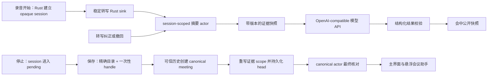

# 05：实时会议摘要与自定义提示词

## 当前结论

Meetily 已完成活动录音到 canonical 会议的 session-scoped 实时摘要主链。录音开始时，Rust 先取得原生 session ID，校验真实录音目录仍在 recordings 根目录内，并把 `session_id + 原生目录 SHA-256` 作为 `pending` 关联写入 SQLite；这是录音核心生命周期的强制步骤，独立于摘要、翻译和 ASR provider，成功后才会发布 `recording-started`。随后实时摘要使用同一 session 与目录建立内存 actor，并只向前端颁发 opaque scope 和一次性绑定 handle。稳定转写由 Rust 持久化 sink 旁路送入 actor，WebView 不能提交摘要正文或证据。停止录音后会话进入 pending，保存逐字稿时以“精确目录 + handle”绑定会议；会议、全部转写 revision 与 `session_id -> meeting_id` 的 `bound` 状态在同一事务提交，再持久化已有会中摘要并启动 canonical actor 最终核对。

非法、过期、已使用、跨目录或历史不完整的 handle 都不会消费可用会话，也不会阻止逐字稿保存：保存命令会明确返回 `summary_binding: rejected`，并沿用 legacy/import/recovery 保存路径。会议已经保存但摘要修订写库或 canonical actor 初始化失败时返回 `pending_retry`，逐字稿和录音仍然成功；当前尚未提供自动重试按钮。

用户可在中文设置卡中选择模板、写入自定义总结要求，并复用现有 OpenAI、Groq、OpenRouter 或自定义 OpenAI-compatible 配置；会议详情页可查看议题、决策、行动项、风险、待确认问题及证据版本，也可请求最终核对。provider 响应由 Rust 异步接收，经过结构与精确证据校验后先写 SQLite，写入成功才推进内存 actor 并发给 WebView。

这仍不是完整的“飞书式实时纪要”。15 至 30 秒合并定时器、完整退避熔断、证据跳转、命名 prompt profile、绑定失败重试 UI、真实在线服务和两小时长会验收仍待完成。本阶段自动测试全部使用确定性 provider 或注入式假 HTTP transport，没有发出真实云请求，因此不能把“代码已接通”表述为“任何供应商和模型都已通过生产验收”。

## 接通模型与界面后会看到什么

会议开始后，字幕继续优先显示原文。实时摘要在旁路处理稳定转写，每隔一小段时间刷新一次：

- “正在讨论”显示当前议题和仍有分歧的问题；
- “已经决定”只保存有明确语义证据的结论；
- “待办事项”保留负责人、动作、时间和证据，缺失字段显示为待确认；
- “风险与阻塞”记录影响、下一步和原话来源；
- 用户修改说话人、纠正转写或删除一句话后，受影响结论会重新计算。

悬浮窗口使用三个逐级展开的模式：字幕、字幕加当前议题、完整会议助手。摘要失败、网络中断或模型过载都不会阻塞字幕与双音轨录音。

## 数据如何流动

协调器只消费 `final`、`correction` 和 `retraction`。快速变化的 partial 仍用于字幕，却不会直接写入决定或待办，从源头减少一句话尚未说完就被总结的问题。

完整 `TranscriptEvent` 不能由 WebView 提交，否则被注入的文本或事件 ID 会成为伪造证据。当前提交入口和 provider 响应入口都是 Rust-only；公开 Tauri 命令只负责读取公开状态、维护不含密钥的偏好，以及返回 Rust 已经生成的 opaque handle。活动录音没有 `meeting_id` 时使用 Rust 管理的 `recording_session` scope；原始 ASR `session_id` 不会充当会议 ID，也不能由 renderer 用正文、事件 ID 或证据来“补齐”范围。

## 摘要结果的数据结构

一段 Markdown 无法可靠表达“哪条待办来自哪句话”。实时结果采用结构化条目，Markdown 仅作为展示和导出格式。

| 字段 | 用途 |
| --- | --- |
| `item_id` | 条目的稳定身份；模型改写文字时仍能更新同一条 |
| `kind` | `topic`、`decision`、`action_item`、`risk` 或 `open_question` |
| `title`、`body` | 给用户阅读的标题与内容 |
| `owner`、`due_at` | 待办负责人和时间；无法确认时保留为空 |
| `evidence` | 一个或多个转写版本引用 |
| `status` | `active`、`needs_review` 或 `retracted` |
| 修订元数据 | `revision`、`generation`、`transcript_cursor`、`snapshot_hash`、`revision_type` 和 `created_at` |

每个证据引用至少包含 `utterance_id`、`source_revision`、`source_event_id` 和规范化文本哈希。只保存一句话的数据库行号不够，因为同一句 partial 可以在相同 revision 内被 final 替换；事件 ID 与文本哈希共同防止旧结果误绑到新文本。

## 增量更新策略

`LiveSummaryActor` 为每场会议维护一个串行状态机。串行处理能避免两个模型请求同时覆盖同一份摘要。

1. 稳定转写先写入 canonical 转写仓库，再交给摘要 actor；这样模型不可用或队列拥塞也不会丢事实来源。
2. 当前切片会立即尝试首个请求；15 至 30 秒合并定时器尚未接入。请求在途期间，同一话语的连续变化会按最新稳定版本合并。
3. 同一场会议最多保留一个在途请求。新事件到达时继续标记 dirty，不并发修改摘要。
4. 请求返回后先检查 generation 和证据版本。旧请求的结果会被丢弃。
5. correction 与 retraction 使引用旧版本的条目进入 `needs_review`，下一轮要求模型重算相关条目。
6. 录音停止先把 session 标为 pending；逐字稿成功保存并完成可信绑定后，canonical actor 会自动执行最终核对。用户仍可在会议详情页再次请求最终核对。

队列达到上限时，运行时把尚未进入 actor 的稳定变化保留在内存延迟队列，并按话语合并；canonical 事件已经先行落库。供应商失败或输出无效时保留最后一条可信修订并暂停自动派发，避免形成无上限云调用循环；下一条稳定字幕或用户显式“最终核对”可以再次生成。带抖动的指数退避、熔断和调用预算仍是后续工作。

## 自定义提示词如何工作

用户可以选择内置模板，也可以追加自己的总结要求，例如“按项目、负责人和截止时间整理”或“保留日语专有名词”。提示词分为四层：

1. 应用策略规定不得编造、必须引用证据，以及输出字段的含义；
2. 模板定义用户希望看到的栏目；
3. 用户补充提示词提供团队术语和偏好；
4. 输出规则要求模型返回固定 JSON 结构。

用户补充内容只能增加偏好，不能覆盖应用策略和结构校验。模板 ID 只接受安全字符，读取文件前还要验证规范化路径仍位于 `portable/app-data/templates`，从而阻止 `../` 一类路径越界。

当前运行时会持久化全局默认 `template_id` 和一份可选自定义提示词。提示词采用“只写不回显”：WebView 只能看到 `hasCustomPrompt`，留空保存会保留旧值，删除必须调用显式命令。Rust provider 将应用策略、模板栏目、用户补充要求和固定 JSON 约束分层拼装；模板指令最多 16000 字符，自定义提示词最多 8000 字符。API key、提示词正文和 provider raw body 不进入实时摘要 DTO、Tauri 事件或结构化摘要表。提示词仍以明文存在 D 盘便携 SQLite 中，“不回显”不是磁盘加密；能够读取整个便携目录的人仍可读取它。

## 本地模型与模型 API

目标架构让同一套协调器通过 `SummaryProvider` 接口调用不同实现：

| 实现 | 适用条件 | 主要代价 |
| --- | --- | --- |
| 内置本地模型 | 隐私优先、离线会议、网络不稳定 | 首次下载较大，持续占用 RAM，低配置设备更新较慢 |
| Ollama 或本地 OpenAI 兼容服务 | 用户已有模型服务 | 需要自行管理服务、模型与端口 |
| OpenAI、Anthropic、Groq、OpenRouter | 需要更高质量或更低本机负载 | 转写证据会发送到所选供应商，并产生网络延迟和费用 |
| 自定义 OpenAI 兼容地址 | 企业网关或其他模型服务 | 地址、证书、鉴权和兼容性由部署方保证 |

公开配置只包含 provider、模型、endpoint 和 `hasApiKey`。设置密钥使用单独写命令，空输入表示保留现有密钥，删除使用显式命令。Rust 日志只记录安全错误码和请求阶段，不记录 Authorization、请求正文、供应商原始响应或密钥。

新的实时协调器已接入 OpenAI、Groq、OpenRouter 和自定义 OpenAI-compatible HTTP provider。远程地址必须使用 HTTPS，本机回环地址才允许 HTTP；地址不能携带用户信息、查询参数或 fragment，HTTP 客户端不跟随重定向，序列化后的请求上限为 512 KiB、响应正文上限为 256 KiB。OpenAI 请求显式发送 `store: false`；为了兼容其他实现，这个厂商字段不会强制发送给 Groq、OpenRouter 或自定义端点。`claude`、`ollama` 和内置本地总结模型在本切片仍明确返回 unsupported/unavailable，不会回退到测试输出。

provider 使用现有密钥设置，Authorization header 会标记为敏感，配置、请求和响应的 `Debug` 实现只显示是否配置和字节数，不显示密钥、提示词、转写正文或 raw body。OpenAI 使用当前推荐的 `max_completion_tokens`，其他兼容端点继续使用普遍兼容的 `max_tokens`。自动测试通过注入式 transport 返回固定 OpenAI 响应；没有调用真实供应商，也没有证明所有兼容服务都接受当前的 `response_format` 等字段。

当前密钥随 Meetily 数据库明文保存在 D 盘便携目录。这比把密钥回传 WebView 安全，但尚未达到操作系统凭据库或应用层加密的保护等级。后续需要提供可选 Windows Credential Manager 存储，并保留“整包迁移时显式导出配置”的路径。

## 版本化存储

实时摘要没有覆盖会议表里的单个 `summary` 字段。当前已经增加以下记录：

- `live_summary_sessions` 保存最新修订、generation、转写游标和 active/finalized 投影；
- `live_summary_revisions` 保存每次完整结构化快照及 provider、model 和创建时间；
- `live_summary_items` 保存议题、决定、待办、风险和开放问题；
- `live_summary_evidence` 把每个条目绑定到准确的转写事件、revision 和文本哈希。

修订、条目、证据和最新投影在同一事务内写入。provider 成功响应先生成“待提交修订”，数据库事务成功后 actor 才推进 revision、generation 和公开条目；写库失败会丢弃待提交值并从 durable snapshot 重建 actor。启动恢复会读取最后一条完整修订，并按 canonical replay 顺序为每个 utterance 只选择一个稳定 head；半写入事务不会成为最新结果。

`live_summary_preferences` 保存默认模板、只写自定义提示词和更新时间。它不保存 API key，也不会把提示词复制到各个会议修订。命名 prompt profile、每会议独立模板、最终结果同步到旧会后摘要字段仍待实现。

活动录音的 actor、opaque scope、一次性 handle 和尚未提交的摘要结果仍只存在于 Rust 内存。handle 不进入 localStorage、sessionStorage、SQLite 或日志；成功绑定后立即消费，内存 pending 默认 30 分钟过期。与之分离的 `recording_session_meeting_bindings` 表只保存后端生成的 session ID、原生录音目录哈希、状态和最终 meeting ID。Windows 哈希直接编码规范路径的 UTF-16 code units，不经过 `to_string_lossy`。录音核心必须在一个事务内写入并复核 pending；目录校验、写入或复核失败都会回滚刚启动的录音，界面不会收到成功事件。保存时，Rust 会从校验后的录音目录哈希直接加载 pending 或 bound，实时摘要未启用或摘要 handle 被拒绝也不会跳过会议绑定；handle 只控制摘要 actor 的后续绑定。若 handle 有效，其 session 和目录必须与持久锚点同时匹配。进程重启后，无 handle 的保存路径会重新读取 recordings 根目录内固定名称的原生恢复文件，以持久目录关联确定 session，重建一次性 actor/handle，再完成或重试 canonical 绑定。正式保存只能把已有 pending 原子更新为 bound，不能在保存时补建 bound 行。若上次进程已经提交会议事务，则直接复用已绑定 meeting ID，避免重复会议；崩溃前尚未提交的会中模型结果无法恢复，会从可信转写重新生成。

## 常见失败与处理

| 问题 | 用户可见结果 | 处理方式 |
| --- | --- | --- |
| 模型请求慢于会议进度 | 摘要更新时间落后 | 单在途请求、dirty 合并、输入窗口压缩，录音与字幕保持独立 |
| 转写后来被纠正 | 旧决定可能失效 | 按证据版本标记待复核，下一轮只重算受影响条目 |
| 模型编造负责人或日期 | 待办看似完整但不可信 | 字段必须有证据；无明确原话时保持为空并标为待确认 |
| 供应商返回 HTML 或敏感错误正文 | 日志或界面可能泄露内容 | Rust 层转换为固定错误码，原始正文不跨进程 |
| 自定义模板路径越界 | 可能读取任意本地文件 | 限制模板 ID，规范化路径并验证目录边界 |
| 录音恢复关联无法写入 | 录音启动失败，不发布成功事件 | 停止采集和 pipeline，保留 error 状态的可诊断目录；修复存储后重试 |
| 应用异常退出 | 实时结果停在旧版本 | 事务化修订与事件游标恢复，停止后再做最终重放 |
| 网络费用失控 | 长会议产生过多请求 | 当前只做输入字符滑窗；最小更新间隔、每场会议调用/费用上限仍是发布前任务 |

## 本切片遇到的问题与解决

| 实现问题 | 本切片的处理 | 尚未完成的边界 |
| --- | --- | --- |
| 同一 revision 可能依次出现 final、correction、retraction | actor 与恢复 SQL 使用相同优先级：final < correction < retraction；高优先级可替换，迟到的低优先级事件不能回滚状态 | 相同优先级、不同事件 ID 且缺少可靠时间裁决时会失败关闭 |
| `MAX(revision)` 联表会在同 revision 多事件时恢复出多个 head | 使用 `ROW_NUMBER()`，按 revision、稳定性、事件类型、created_at、event_id 排序，每个 utterance 只恢复一条 canonical head | 大型真实数据库上的恢复耗时尚未建立基线 |
| 队列满或 provider 不可用时容易静默丢转写 | 先持久化 canonical 事件，再进入 actor；延迟队列按 utterance 合并，并在响应后继续排空 | 应用进程在延迟队列排空前退出时，下一次启动依靠数据库重建，而非恢复内存队列 |
| 测试 fake 可能误入生产并显示假摘要 | 确定性 actor fake 和假 HTTP transport 只在 `cfg(test)` 编译；生产工厂只使用真实配置或明确 unavailable | 在线 provider 尚未做真实网络验收；本地 provider 仍需单独适配 |
| 模型响应可能携带无关字段或伪造证据 | provider 响应只从 Rust 内部入口进入；限制为 256 KiB，只接受 JSON 或单层 JSON code fence，再校验 request ID、generation、快照哈希、字段结构和精确证据 | 尚未实现一次受控修复重试；当前无效输出返回固定错误码并等待下一次生成 |
| 摘要修订写库失败时内存 actor 可能已推进计数 | 使用 prepare → persist → commit 两阶段；失败时从 durable canonical 转写和最后完整摘要重建 actor，上一版可信结果不变 | 连续磁盘故障的退避与告警聚合仍待实现 |
| WebView 可能伪造摘要证据，或日志泄露提示词、密钥和原始响应 | 完整转写和 provider 响应都使用 Rust-only 入口；公开 IPC 只传 `template_id`、结构化条目和固定错误码；数据库 schema 也不含密钥、prompt 或 raw body | 现有配置库中的密钥仍是 D 盘数据库明文，凭据库迁移待实现 |
| 活动录音没有 canonical `meeting_id` | Rust 录音核心在公开 start 边界前校验目录并持久化 pending 的 session + 原生目录哈希，失败即回滚；摘要随后创建 opaque scope，stop/save 用一次性 handle 绑定，重启后则从受限原生恢复文件重建 handle | 崩溃前未提交的模型输出不会保存，只能从原生转写重新生成；真实强杀时序仍需桌面 E2E |
| 错误或跨场 handle 误绑、重复绑定 | invalid/expired/used/mismatch 明确返回 rejected；只有正确 pending session 能进入 prepare，成功完成后 handle 进入哈希 tombstone | 自动化覆盖同目录、跨目录、跨会议、过期和重复使用；真实异常退出时序仍需桌面 E2E |
| 摘要历史达到容量后截断并覆盖逐字稿 | registry 标记可信历史不完整，拒绝摘要绑定并退回 legacy 逐字稿保存；不会用截断历史创建会议 | 默认上限 20000 个事件，需要以两小时真实 partial 频率评估容量 |
| 绑定后的摘要持久化或 provider 失败 | transcript save 先成功；同步绑定失败返回 `pending_retry`，异步 provider 失败只改变摘要状态，保留上一版可信结果 | 尚无自动重试按钮和通知聚合 |

## 验收方式

当前自动化测试已覆盖：

- 同一转写事件重复送达不会生成重复决定或待办；
- 旧 revision、旧 generation 和乱序模型响应无法覆盖新结果；
- 修改一句已引用话语后，只有相关条目进入待复核并被更新；
- 重启应用可以恢复最后一条完整摘要修订，并从事件游标继续；
- 同 revision 的 partial、final、retraction 恢复时只产生一个 canonical head；
- provider 不可用时转写仍会落库，生产路径不会产生 fake 摘要；
- 公共快照序列化不包含 API key、prompt 或 provider raw body；
- 证据不匹配时整条摘要修订事务回滚；
- 写库失败不会推进 actor，并会从 durable state 重建；修复存储后可通过显式最终核对重新生成；
- 自定义提示词不会出现在 public preferences JSON，留空更新不会意外删除旧提示词；
- 注入式 OpenAI-compatible HTTP 响应可以经过异步 channel、协调器、证据校验和 SQLite 提交形成一条完整修订，测试不访问云端；
- OpenAI 请求包含 `store: false`，自定义兼容端点不强制携带该字段。
- 录音 start 即创建稳定 opaque scope；即使没有任何转写，stop 后也能进入 pending 并完成一次性绑定；
- pending 的 session/目录关联由录音核心在成功事件前登记，可在新数据库连接中重新读取；缺少 pending 的正式 bind 会失败关闭；会议、转写和 bound 映射同事务提交，转写失败会全部回滚；
- 实时摘要未启用时，保存仍会按受限录音目录加载 durable session，首次保存完成 pending，重复保存复用同一 meeting ID；
- 模拟“会议事务已提交、进程未返回结果”的重复保存会返回同一 meeting ID，数据库中只保留一场会议；
- 原生恢复历史可以重建 pending registry，混入不同 session 的事件会在修改 registry 前失败关闭；
- 有效 handle 只读取 Rust registry 的可信历史，session 修订绑定会议时会重写 revision 与每条 evidence 的 scope，同时保留事件 ID、revision 和文本哈希；
- 错误 handle、目录不匹配、跨会议、过期和重复使用均失败关闭，正确 handle 仍可继续；
- registry 历史达到容量时不使用截断数据，绑定被拒绝并保留 legacy 逐字稿保存路径；
- session 公开 JSON 没有伪造 `meetingId`，只包含稳定 `sessionScopeId`，handle 不出现在公开摘要事件中。

仍必须人工或端到端验证：使用测试账号连接实际 OpenAI/Groq/OpenRouter/企业网关；断网、超时、无效 JSON 不影响录音与字幕；Tauri 事件和 Debug 日志无敏感数据；实际桌面录音的 stop/save 自动绑定与最终核对；每个条目都能跳回证据；两小时会议的延迟、内存和调用费用保持在预算内。

质量评测还需要独立指标：决定和待办的证据支持率、遗漏率、错误归因率、修订收敛时间、p95 更新延迟、每小时调用成本与两小时稳定性。主观“总结不错”不能作为发布结论。

## 当前实现边界

已落地的切片包括安全配置与 endpoint 边界、结构化摘要 contract、串行 actor、两阶段持久化、版本化 SQLite 存储、canonical 会议重启恢复、OpenAI-compatible 异步 provider、安全 Tauri 控制命令/事件、只写自定义提示词、中文设置卡、会议详情结构化摘要面板，以及活动录音的 session actor、Rust-only sink、start/stop/save 一次性绑定和自动最终核对。

尚未落地的是：崩溃前未提交会中摘要内容的恢复、`pending_retry` 用户操作入口、15 至 30 秒合并定时器与完整退避熔断、本地 provider、命名 prompt profile、证据原文跳转、费用预算、真实网络/桌面 E2E 和长会议验收。因此阶段 05 可标记为“活动录音主链与 session 绑定恢复已接线、生产验收待完成”，不能表述为完整飞书能力。
